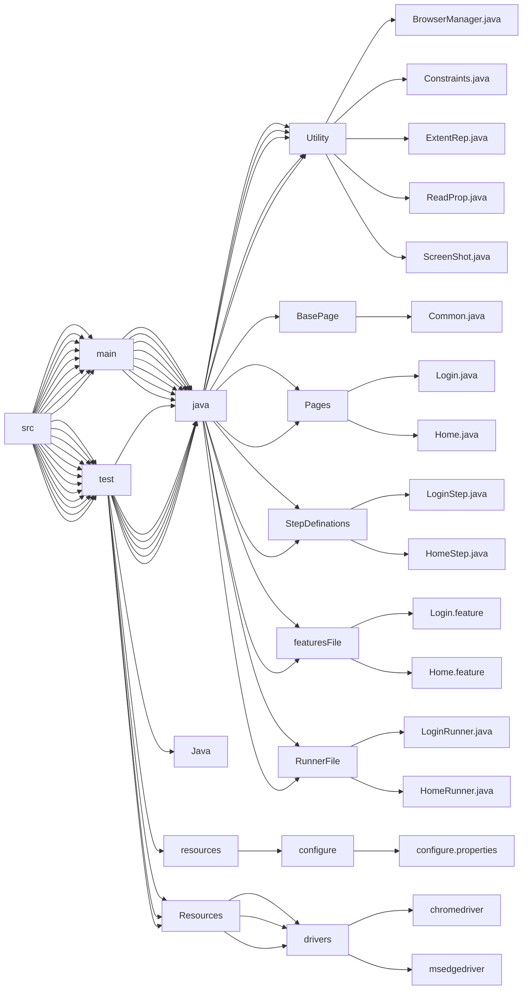

# How to access this project
1. Clone the project using :-
   ```batch
   git clone https://github.com/FouzanJafriFouzanJafri_BDDCucumber_FrameWork 
   ```
2. Got to the project directory and into the suite folder
3. Open testng.xml available in suites folder in eclipse IDE.
4. Run the xml file as TestNG Suite 

## Framework file strucuture


## Driver flow
```mermaid 
flowchart TD;
Testng.xml-->browserName1-->ConfigurationReader-->Browser.setProperty-->Prerequisite.driver
